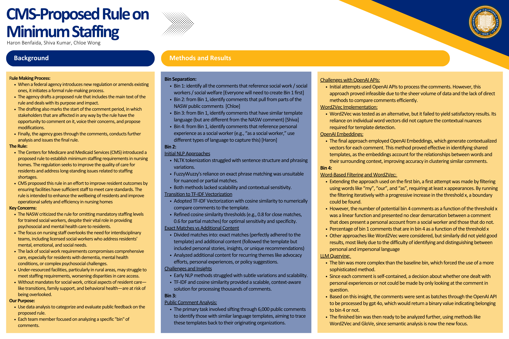

# CMS-Proposed Rule on Minimum Staffing

This project analyzes and categorizes public feedback on the Centers for Medicare and Medicaid Services (CMS) proposed rule regarding minimum staffing requirements in nursing homes. The regulation aims to improve the quality of care for residents and address staffing shortages. Using data analysis and natural language processing (NLP) techniques, we systematically evaluate the public comments on this proposed rule.

---

---

## Background

### Rule Making Process:
- When a federal agency introduces new regulation or amends existing ones, it initiates a formal rule-making process.
- The agency drafts a proposed rule that includes the main text of the rule and deals with its purpose and impact.
- The drafting also marks the start of the comment period, in which stakeholders that are affected in any way by the rule have the opportunity to comment on it, voice their concerns, and propose modifications.
- Finally, the agency goes through the comments, conducts further analysis, and issues the final rule.

### The Rule:
- The Centers for Medicare and Medicaid Services (CMS) introduced a proposed rule to establish minimum staffing requirements in nursing homes. The regulation seeks to improve the quality of care for residents and address long-standing issues related to staffing shortages.
- CMS proposed this rule in an effort to improve resident outcomes by ensuring facilities have sufficient staff to meet care standards. The rule is intended to enhance the well-being of residents and improve operational safety and efficiency in nursing homes.

### Key Concerns:
- The NASW criticized the rule for omitting mandatory staffing levels for trained social workers, despite their vital role in providing psychosocial and mental health care to residents.
- The focus on nursing staff overlooks the need for interdisciplinary teams, including licensed social workers who address residents' mental, emotional, and social needs.
- The lack of social work requirements compromises comprehensive care, especially for residents with dementia, mental health conditions, or complex psychosocial challenges.
- Under-resourced facilities, particularly in rural areas, may struggle to meet staffing requirements, worsening disparities in care access.
- Without mandates for social work, critical aspects of resident care—like transitions, family support, and behavioral health—are at risk of being overlooked.

### Our Purpose:
- Use data analysis to categorize and evaluate public feedback on the proposed rule.
- Each team member focused on analyzing a specific “bin” of comments.

---

## Methods and Results

### Bin Separation:
1. **Bin 1**: Identify all the comments that reference social work / social workers / social welfare.
2. **Bin 2**: Identify comments that pull from parts of the NASW public comments.
3. **Bin 3**: Identify comments that have similar template language (but are different from the NASW comment).
4. **Bin 4**: Identify comments that reference personal experience as a social worker (e.g., “as a social worker,” using different types of language to capture this).

---

### Bin 2: Initial NLP Approaches
- **NLTK tokenization** struggled with sentence structure and phrasing variations.
- **FuzzyWuzzy’s reliance on exact phrase matching** was unsuitable for nuanced or partial matches.
- Both methods lacked scalability and contextual sensitivity.

#### Transition to TF-IDF Vectorization:
- Adopted **TF-IDF Vectorization with cosine similarity** to numerically compare comments to the template.
- Refined cosine similarity thresholds (e.g., 0.8 for close matches, 0.6 for partial matches) for optimal sensitivity and specificity.

#### Exact Matches vs. Additional Content:
- Divided matches into **exact matches** (perfectly adhered to the template) and **additional content** (followed the template but included personal stories, insights, or unique recommendations).
- Analyzed **recurring themes** like advocacy efforts, personal experiences, or policy suggestions.

#### Challenges and Insights:
- Early NLP methods struggled with subtle variations and scalability.
- TF-IDF and cosine similarity provided a **scalable, context-aware solution** for processing thousands of comments.

---

### Public Comment Analysis:
- The primary task involved sifting through **6,000 public comments** to identify those with similar language templates, aiming to trace these templates back to their originating organizations.

---

### Bin 4: Word-Based Filtering and Word2Vec:
- Extending the approach used on the first bin, a first attempt was made by filtering using words like **“my”, “our”, and “as”**, requiring at least **x** appearances.
- By running the filtering iteratively with a progressive increase in the threshold **x**, a boundary could be found.
- However, the number of potential bin 4 comments as a function of the threshold **x** was a **linear function** and presented **no clear demarcation** between a comment that does present a personal account from a social worker and those that do not.
- **Percentage of bin 1 comments** that are in bin 4 **as a function of threshold x**.
- Other approaches like **Word2Vec** were considered, but similarity did not yield good results, most likely due to the difficulty of identifying and distinguishing between personal and impersonal language.

---

### LLM Querying:
- The bin was more complex than the baseline bin, which forced the use of a more sophisticated method.
- Since each comment is **self-contained**, a decision about whether one dealt with personal experiences or not could be made **by only looking at the comment** in question.
- Based on this insight, the comments were sent as **batch queries to OpenAI API** to be processed by **GPT-4o**, which would return a **binary value** indicating belonging to bin 4 or not.
- The finished bin was then ready to be analyzed further, using methods like **Word2Vec** and **GloVe**. **Sine semantic analysis** is now the new focus.

---

